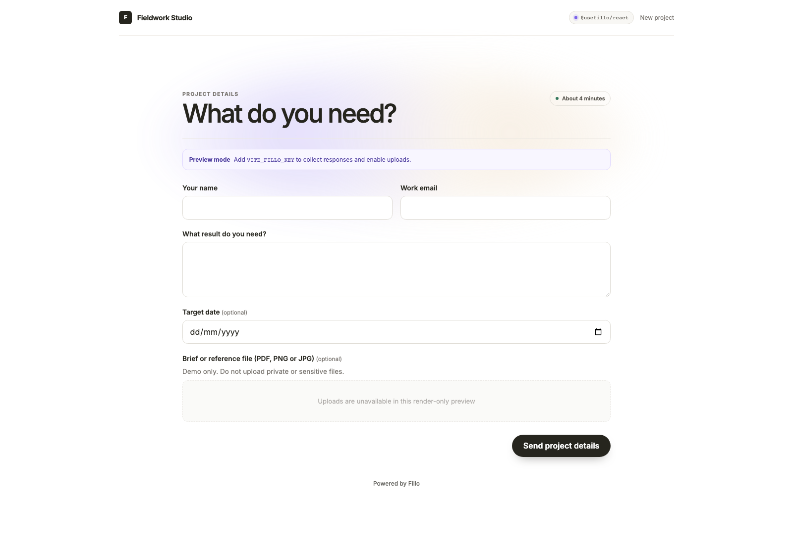
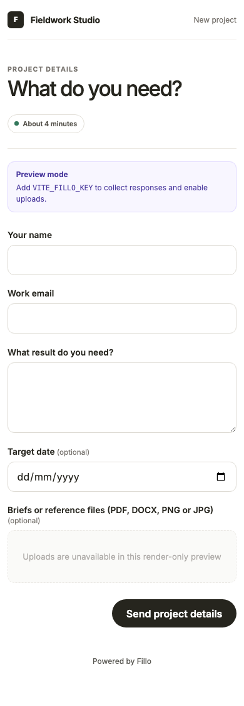

# Client intake form with file uploads for Vite and React

[](https://github.com/jacobfunch/fillo-vite-client-intake-starter/actions/workflows/ci.yml)

Use this starter to collect a client's contact details, project brief and files
in one response. `@usefillo/react` renders the form in the page. The browser
sends files straight to the storage connected to Fillo. The public demo accepts
one PDF or image up to 1 MB and requires Fillo's human check.

[Open the demo](https://jacobfunch.github.io/fillo-vite-client-intake-starter/) ·
[Read the setup guide](https://fillo.so/guides/client-intake-form-with-file-uploads) ·
[React SDK](https://www.npmjs.com/package/@usefillo/react) ·
[File upload docs](https://fillo.so/docs/uploads)



<details>
<summary>View the mobile layout</summary>
<br />

</details>

## Run the preview

```bash
npm install
npm run dev
```

Open [http://localhost:5173](http://localhost:5173). You do not need a Fillo
account. Without a key, the page shows **Preview mode**. You can fill in the
form and see the success message. The preview does not upload files, send
answers or change a form in Fillo.

## What you get

- A form schema in `src/IntakeForm.tsx`.
- React form controls that you can style with normal CSS. There is no iframe.
- A light and dark theme that follows the visitor's system setting.
- A file field that sends files straight from the browser to connected storage.
- A local preview that works before you add a key.
- Build checks for pull requests and a GitHub Pages preview.

## Connect the form to Fillo

1. [Create or open a Fillo workspace](https://fillo.so/start?from=github-vite-client-intake).
2. Connect Google Drive, Box, Amazon S3 or an S3-compatible bucket such as
   Cloudflare R2.
3. Copy `.env.example` to `.env.local`.
4. Set `VITE_FILLO_KEY` to the workspace's public `pk_` key.
5. Add `http://localhost:5173` to the workspace's allowed origins.
6. Restart Vite and open the page. This syncs `vite-client-intake`.
7. Review and publish the form in Fillo.
8. Submit one test response with a small file.
9. Find the response and file reference in Fillo.

The 1 MB limit is deliberately conservative for the public demo. Raise
`maxFileSizeMb` only after you connect storage that is suitable for your own
files and retention policy.

Some eligible new workspaces can use temporary Fillo storage while testing. It
accepts files up to 10 MiB, with 100 MiB available per workspace. Completed
files expire after seven days. Connect your own storage before you collect
client files.

## Deploy the connected demo

The GitHub Pages workflow reads `VITE_FILLO_KEY` from a repository Actions
variable. Use a dedicated demo workspace and storage destination for a public
deployment.

1. Add `https://jacobfunch.github.io` to the workspace's allowed origins.
2. Select the storage destination for `vite-client-intake` and publish the
   form.
3. Add the workspace's public `pk_` key as the repository variable
   `VITE_FILLO_KEY`.
4. Run the **Deploy demo to GitHub Pages** workflow.

The publishable key is designed for browser code. Do not put a CLI token,
workspace API key, storage credential or webhook secret in the workflow.

## Change the example

You can change the labels, help text, colours and layout. Keep these IDs after
you collect the first response:

- form: `vite-client-intake`;
- fields: `name`, `email`, `outcome`, `target-date`, `documents`.

Fillo uses the field IDs as stored answer keys. Keep field conditions in the
schema. Before you add or change a file field, check `canPublishFileFields`.

Do not add another upload API. Let Fillo create the upload session and let the
browser send the file to the storage provider. Use a signed webhook if your
backend must act on each response.

## Use a coding agent

[AGENTS.md](AGENTS.md) lists the files, IDs and checks for this repository.

Connect an existing Fillo workspace and install the Fillo skill:

```bash
npx @usefillo/cli@latest login
npx @usefillo/cli@latest skill install
```

If you do not have a workspace, run:

```bash
npx @usefillo/cli@latest agent bootstrap --email you@company.com
```

Then give the agent a specific task:

> Use the build-with-fillo skill. Adapt this form for our client portal. Keep
> the current page design and the existing form and field IDs. Check storage
> before you change the file field. Run the production build. Check the page on
> desktop and mobile. List the steps I must complete in Fillo.

The skill supports Codex, Cursor, GitHub Copilot, Gemini CLI, Claude Code and
other compatible agents. [Read the agent setup guide](https://fillo.so/agents).

## Check before production

Run:

```bash
npm run build
```

Then complete these checks:

1. Leave each required field empty and check the error.
2. Select a file type that the form does not accept.
3. Interrupt an upload and try it again.
4. Use the form with a keyboard and on a phone.
5. Submit a response and find its file in Fillo.

## More help

- [Client intake setup guide](https://fillo.so/guides/client-intake-form-with-file-uploads)
- [File upload setup](https://fillo.so/docs/uploads)
- [Client intake template](https://fillo.so/templates/client-intake-form)
- [How Fillo handles a form request](https://fillo.so/guides/native-form-request-lifecycle)
